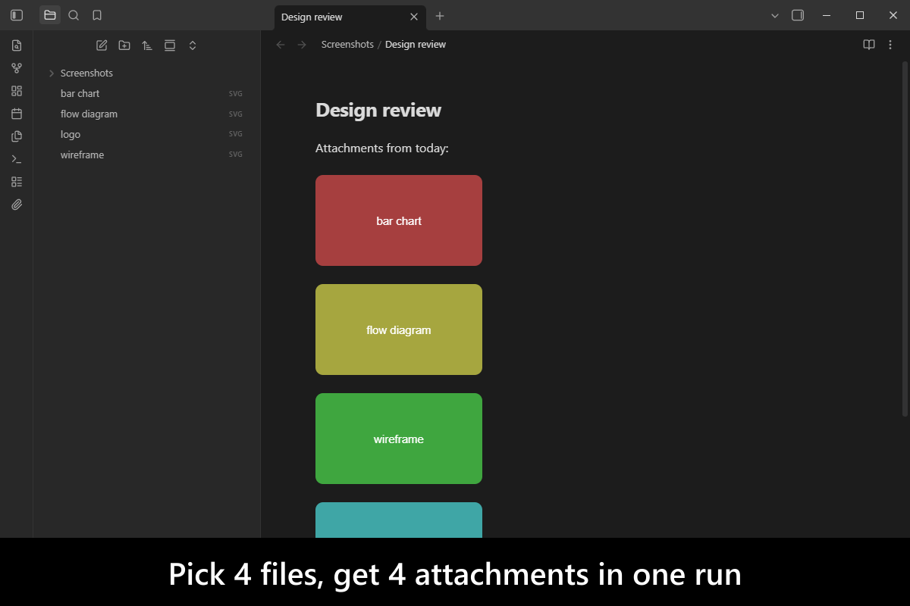
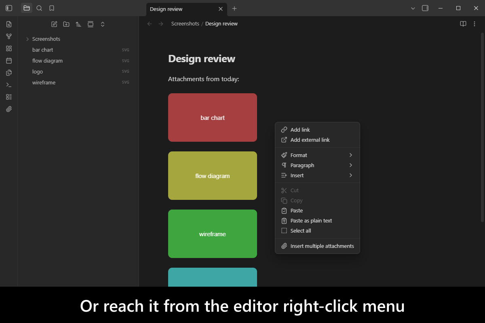
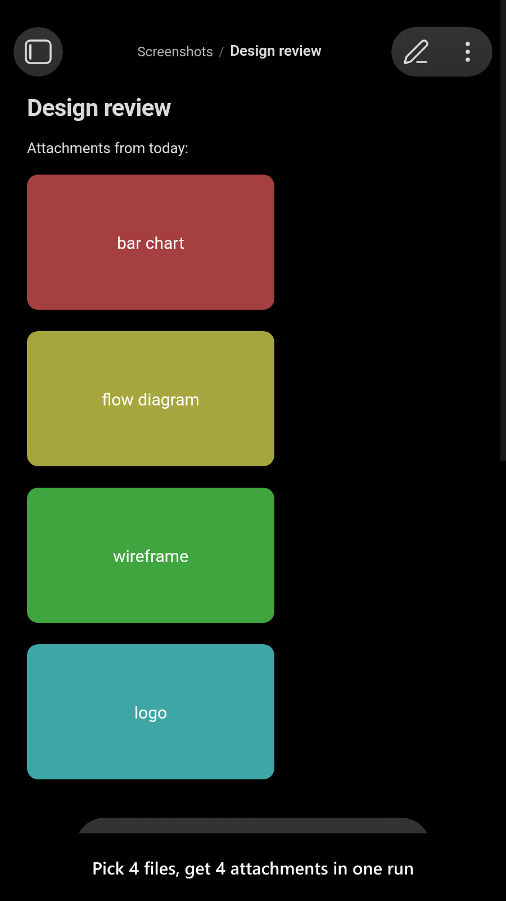
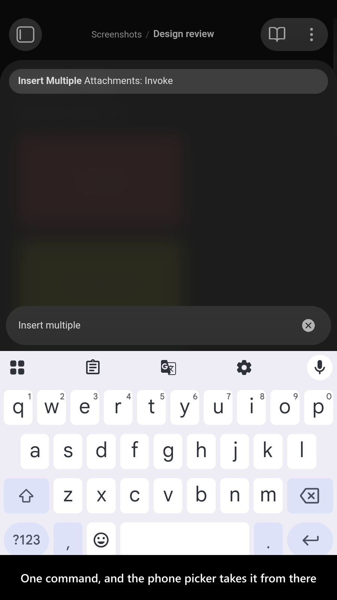

# Insert Multiple Attachments

[](https://www.buymeacoffee.com/mnaoumov) [](https://github.com/mnaoumov/obsidian-insert-multiple-attachments/releases) [](https://github.com/mnaoumov/obsidian-insert-multiple-attachments/releases) [](https://github.com/mnaoumov/obsidian-insert-multiple-attachments)

[Obsidian](https://obsidian.md/)'s built-in **Insert attachment** command opens a file picker that accepts exactly one file. Attaching six screenshots to a note therefore means running it six times, each with its own dialog.

This plugin adds a command that opens a **multi-select** picker instead: choose as many files as you like, and every one is saved as an attachment and embedded at the cursor in a single run.

<!-- markdownlint-disable MD033 -->

<a href="https://github.com/mnaoumov/obsidian-insert-multiple-attachments/blob/HEAD/images/screenshots/screenshot-desktop-1.png"></a>

<details>
<summary>More screenshots</summary>

<div>
<a href="https://github.com/mnaoumov/obsidian-insert-multiple-attachments/blob/HEAD/images/screenshots/screenshot-desktop-2.png"></a>
<a href="https://github.com/mnaoumov/obsidian-insert-multiple-attachments/blob/HEAD/images/screenshots/screenshot-mobile-1.png"></a>
<a href="https://github.com/mnaoumov/obsidian-insert-multiple-attachments/blob/HEAD/images/screenshots/screenshot-mobile-2.png"></a>
</div>

</details>

<!-- markdownlint-enable MD033 -->

## Demo vault

**The documentation is a demo vault.** Every feature has a note that explains what it does and why you would want it, with sample files ready to insert.

**[Start reading here](<./demo-vault/00 Start.md>)** — it is plain markdown, so it works on GitHub with nothing installed.

A copy of the vault ships with every release. You can access it via any of the following:

1. Running the **Insert Multiple Attachments: Open demo vault** command.
2. Downloading `insert-multiple-attachments-demo-vault-<version>.zip` (`<version>` is the release version) from the [Releases](https://github.com/mnaoumov/obsidian-insert-multiple-attachments/releases).
3. Browsing its source in [`demo-vault/`](./demo-vault/README.md) in this repository.

## What it does

- **Insert many attachments at once**, from the Command Palette, the ribbon paperclip, or the editor right-click menu — the last two switchable off if you do not want them. [01 Insert multiple attachments](<./demo-vault/01 Insert multiple attachments.md>)
- **Control the text around the links** — a prefix, a delimiter between them, and a suffix — so six embeds can come out as a list, a gallery row, or whatever your note needs. [02 Link formatting](<./demo-vault/02 Link formatting.md>)
- **Every setting**, by the key it is stored under. [03 Settings](<./demo-vault/03 Settings.md>)

Each file lands in your vault's own attachment folder, exactly as Obsidian's single-file command would put it there.

## Installation

The plugin is available in [the official Community Plugins repository](https://community.obsidian.md/plugins/insert-multiple-attachments).

### Beta versions

To install the latest beta release of this plugin (regardless if it is available in [the official Community Plugins repository](https://community.obsidian.md) or not), follow these steps:

1. Ensure you have the [BRAT plugin](https://community.obsidian.md/plugins/obsidian42-brat) installed and enabled.
2. Click [Install via BRAT](https://intradeus.github.io/http-protocol-redirector?r=obsidian://brat?plugin=https://github.com/mnaoumov/obsidian-insert-multiple-attachments).
3. An Obsidian pop-up window should appear. In the window, click the `Add plugin` button once and wait a few seconds for the plugin to install.

## Debugging

By default, debug messages for this plugin are hidden.

To show them, run the following command:

```js
window.DEBUG.enable('insert-multiple-attachments');
```

For more details, refer to the [documentation](https://mnaoumov.dev/obsidian-dev-utils/guides/debugging/).

## Changelog

All notable changes to this project will be documented in the [CHANGELOG](./CHANGELOG.md).

## Contributing

Contributions are welcome — see [CONTRIBUTING](./CONTRIBUTING.md) to get set up.

## Support

<!-- markdownlint-disable MD033 -->

<a href="https://www.buymeacoffee.com/mnaoumov" target="_blank"></a>

<!-- markdownlint-enable MD033 -->

## My other Obsidian resources

[See my other Obsidian resources](https://github.com/mnaoumov/obsidian-resources).

## License

© [Michael Naumov](https://github.com/mnaoumov/)
